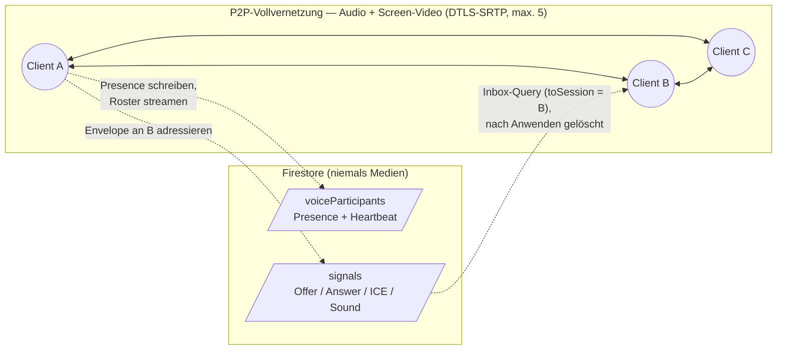

# Vibo

<p align="center">
  
</p>

**Echtzeit-Teamchat mit Channels, Direktnachrichten, Threads und P2P-Sprachkanälen — als Solo-Portfolio-Projekt auf Angular 21 gebaut.**

🔗 **Live:** <https://vibo.yannick-oetelshoven.at/>

👉 **Sofort ausprobieren — ohne Registrierung:** Der Button **Gäste-Login** führt direkt in einen öffentlichen, geteilten Demo-Account. Das Gastprofil wird bei jedem Login zurückgesetzt, damit Sessions nicht ineinander laufen.

---

## Über das Projekt

Vibo ist eine Echtzeit-Chat-App im Stil von Slack/Discord: **Channels, Direktnachrichten, Threads** und **persistente Sprachkanäle mit Peer-to-Peer-Audio und Screen-Sharing**, verpackt in ein kosmisches Glas-Design mit Dark/Light-Theme. Gestartet als Abschlussprojekt der Developer Akademie (ursprünglich im Team), wurde die App **solo neu aufgebaut und stark erweitert** — auf Angular 21 mit Signals, einem strikten, selbst auferlegten Engineering-Budget und Barrierefreiheit und Performance als festen Anforderungen.

Das Interessante ist weniger die Feature-Liste als die Entscheidungen dahinter: siehe **[Architektur-Highlights](#architektur-highlights)** und das laufend gepflegte Entscheidungs-Log **[DEVIATIONS.md](DEVIATIONS.md)**.

---

## Features

**Chat & Kanäle**

- Echtzeit-**Channels**, **Direktnachrichten** und **Threads** — Reply-Anzahl und letzte Antwort sind auf die Elternnachricht denormalisiert, Thread-Vorschauen kosten also null zusätzliche Reads
- **Markdown** (fett/kursiv, Listen, Zitate, Links) mit **syntaxhervorgehobenen Codeblöcken** inkl. Copy-Button, **||Spoiler||** und **YouTube-Embeds** als Click-to-Play-Fassade (vor dem Klick lädt nur das Thumbnail)
- **Eigene Nachrichten bearbeiten** (15-Minuten-Fenster, auch in den Security Rules erzwungen) und **löschen** — „Für mich" / „Für alle" mit WhatsApp-artigem Tombstone
- **Emoji-Reaktionen** (Picker, Schnellreaktionen, „Wer hat reagiert"-Tooltip) plus **große Reaktionen** mit Fullscreen-Effekten (Konfetti, Herzen, Rakete …)
- **Anpinnen** von Nachrichten, **@Erwähnungen**, Inline-**Antworten** mit Zitat-Snapshot
- **Aktivitäts-Benachrichtigungen** (Glocke + Toast) für Thread-Antworten, Reaktionen, Erwähnungen und Antworten — Fan-out sender­seitig, ein einziger schmaler Listener pro Nutzer
- **⌘K/Strg+K-Befehlspalette** (lazy geladen), **globale Suche** über zugängliche Channels und eigene Unterhaltungen, **Giphy-GIF-Picker** (PG-13-gefiltert auf jedem Request) mit persistenten Kategorie-Chips über einem großen Masonry-Grid („Favoriten", „Angesagt", zehn kuratierte Begriffe; Sentinel-Nachladen in 24er-Seiten bis 96 Ergebnisse), **GIF-Favoriten** per Stern (ein Firestore-Dokument pro Nutzer, One-Shot gelesen) und dauerhaft sichtbarer „Powered by GIPHY"-Attribution
- **Lesebestätigungen** im WhatsApp-Stil (grau → grau → blau) mit „Gelesen von"-Liste, Tipp-Indikator, Ungelesen-Badges
- **Eingabehilfen im Composer**: Emoticons wie `:)` `:D` `<3` werden beim Tippen an Wortgrenzen automatisch zum Emoji (URLs bleiben unangetastet, Backspace stellt das Emoticon wieder her), und **„:kurzname"-Vorschläge** öffnen ab zwei Zeichen ein Emoji-Dropdown mit deutschen Namen und Twemoji-Grafiken — vollständig clientseitig

**Social & Sharing**

- **Freundschaftssystem**: Anfragen senden/annehmen/ablehnen, Entfreunden, **Blockieren** (friert die Unterhaltung beidseitig ein — auch in den Rules)
- **Freunde-Ansicht** mit Tabs „Alle"/„Anfragen" und integrierter Nutzersuche
- **Einladungslinks** für Channels (ablaufend, Token = Zugriffsnachweis) — optional mit **Vanity-Slug** (…/#/invite/cozy-vibes): Der Channel-Ersteller vergibt einen sprechenden Link-Namen, dessen Eindeutigkeit über das Reservierungsmuster der Usernames gesichert ist — das atomare Anlegen des Slug-Dokuments IST die Verfügbarkeitsprüfung, beim Tippen fällt kein einziger Read an. Beim Einlösen wird immer zuerst das Token aufgelöst und erst bei einem Miss der Slug, ein Slug kann also nie ein Token überdecken. Einladungslinks (Token wie Slug) lösen auch für Gäste auf, der Beitritt selbst erfordert aber ein registriertes Konto — auf der Einlöse-Karte greift unverändert die bestehende Gast-Sperre.
- **Profile** mit animierten kosmischen Avataren (Hover-to-Play-WebP, Standbild bei `prefers-reduced-motion`), Bannern, Badges, Custom-Status und Live-Präsenz
- **Manueller Status** im Discord-Stil mit vier Zuständen: Online, Abwesend, Beschäftigt (Benachrichtigungstöne aus) und Unsichtbar (erscheint für andere als offline) — wählbar über die Statuszeile im eigenen Profil. Die manuelle Wahl ist sticky: Sie gilt über Sitzungen und Geräte hinweg, bis sie geändert wird. Ohne manuelle Wahl schaltet die Präsenz automatisch — nach 5 Minuten Inaktivität auf Abwesend, nach 60 Minuten auf Offline. Jeder Zustand hat Form UND Farbe (gefüllter Punkt, Mond, Balken, hohler Ring), nie Farbe allein.
- **Auth:** E-Mail/Passwort, Google-Sign-in und der Ein-Klick-**Gastzugang**. Neue Konten bestätigen ihre E-Mail-Adresse über einen Verifizierungslink, bevor sie die App betreten — serverseitig in den Security Rules erzwungen, nicht nur im Client; der Gastzugang ist bewusst ausgenommen. Bestandskonten werden beim nächsten Login sanft auf die Bestätigungsseite geleitet. Das eigene Passwort lässt sich in den Einstellungen ändern (Re-Authentifizierung mit dem aktuellen Passwort, mindestens 8 Zeichen).

**Sprachkanäle**

- **Persistente Voice-Channels** im Discord-Stil — Audio läuft **strikt Peer-to-Peer** (Vollvernetzung bis 5 Teilnehmer, DTLS-SRTP, Stereo-Opus mit FEC); Firestore transportiert **ausschließlich Presence und Signaling, niemals Medien**. Die Audioqualität reicht bis zu **384 kbit/s Stereo** (Opus-VBR-Obergrenze, keine Dauerlast).
- **Screen-Sharing** über Renegotiation auf derselben Mesh (ein Sharer pro Kanal, 2 Mbit/s pro Leg, `maintain-resolution` für scharfen Text), Viewer-Dialog mit Fullscreen
- **Soundboard**: zehn kuratierte Presets (u. a. Woah, Drumroll, Evil Laugh) als loudness-normalisierte MP3-Dateien, lazy geladen und pro Session gecacht — ausgelöst wird per kurzlebigem Signal mit Sound-Kennung, Audiodaten fließen nie durch Firestore; keine Uploads
- Mute/Deafen mit Discord-Paritäts-Verhalten, lokale Speaking-Erkennung (AnalyserNode, null Firestore-Writes), Creator-only Umbenennen/Löschen
- **Pro-Nutzer-Lautstärke (0–200 %)** mit lokalem Stummschalten über das ⋮-Menü jeder Teilnehmerzeile — ein WebAudio-GainNode pro Peer mit sanfter Rampe, lokal gespeichert und beim nächsten Verbinden automatisch wieder angewendet
- **Mikrofonauswahl** in den Einstellungen (Bereich „Sprache"): Systemstandard oder ein konkretes Eingabegerät — die Wahl gilt pro Gerät (lokal gespeichert), wechselt **live mitten im Gespräch** ohne Neuverhandlung (die Stummschaltung bleibt dabei erhalten) und fällt sicher auf den Systemstandard zurück, wenn das gespeicherte Mikrofon gerade fehlt

**Sound-Design**

- Zentrale **Web-Audio-Engine**: alle UI-Sounds (Senden, Empfangen, Löschen, Reaktion, Fehler, Voice-Join/-Leave) werden **zur Laufzeit synthetisiert** (kein einziges UI-Sound-Asset), melodische Klänge laufen durch einen **code-generierten Convolver-Reverb**; die Soundboard-Presets werden lazy dekodiert und folgen derselben Master-Lautstärke — empfangene Broadcasts rendern auf dem AudioContext der Voice-Verbindung, damit sie auch auf Mobilgeräten zuverlässig hörbar sind
- Einstellungen mit Master-Toggle, eigenem Lautstärke-Slider und Opt-in-Seitenleisten-Sound

**PWA**

- **Installierbar** (Manifest, Icons, Angular Service Worker); bereits besuchte Views funktionieren **offline** (Firestore-Offline-Persistenz, Multi-Tab)
- Update-Flow ohne Zwangs-Reload: Toast „Neue Version verfügbar" mit Aktion „Neu laden"

**Barrierefreiheit & Performance**

- **WCAG 2.1 AA in beiden Themes** — Kontraste gemessen, nicht angenommen; durchgängig tastaturbedienbar; korrekte Dialog-/Combobox-Semantik; `prefers-reduced-motion` und `prefers-reduced-transparency` respektiert
- **Responsiv bis 320 px**, mobile Bottom-Sheets mit echter Drag-Physik, **CLS = 0** überall
- **Lighthouse:** lokaler Production-Build-Closeout Desktop **99 / 100 / 100 / 100**, Mobil **72–78 / 100 / 100 / 100**; gegen das Live-Deployment gemessen **95 / 100 / 96 / 100** (dokumentierter v1.0-Finalstand) bzw. **96 / 100 / 96 / 100** (späterer owner-gemessener Spot-Check) — jeweils Performance/Accessibility/Best Practices/SEO. Die mobile Lücke ist der dokumentierte Preis des eager geladenen Firebase-SDK; Channel-Views mit GIF-Embeds erreichen Best Practices 96 statt 100 — der akzeptierte Preis der byte-sparenden GIF-Renditions. Beides ist in [DEVIATIONS.md](DEVIATIONS.md) begründet, nichts davon versteckt.

---

## Tech-Stack

| Bereich | Wahl |
|---|---|
| **Framework** | Angular **21.2** — Standalone Components, **Signals**, neue Control-Flow-Syntax (`@if`/`@for`/`@defer`), `OnPush` |
| **Sprache** | TypeScript **5.9** (strict, kein `any`) |
| **Styling** | SCSS — **7-1-Architektur**, BEM, Design-Token-Maps (`color()` / `space()` / `font-size()`) |
| **Backend** | **Firebase** — Authentication + Cloud Firestore (Spark-Plan; bewusst ohne Cloud Functions und ohne Storage) |
| **Voice/Video** | **WebRTC** (P2P-Vollvernetzung, STUN-only), Web Audio API |
| **Markdown** | `marked` → **DOMPurify** (Allow-List) → vertrauenswürdige Anreicherung |
| **Code-Highlighting** | `highlight.js` (deferred Chunk, kuratiertes Sprachset) |
| **Emoji** | **Twemoji** (jdecked-Fork), self-hosted SVG |
| **GIFs** | **Giphy** REST API (`rating=pg-13` auf jedem Request) |
| **Routing** | Hash-basiert (`withHashLocation`) für statisches Hosting ohne Serverkonfiguration |
| **PWA** | `@angular/service-worker` (ngsw), Firestore-Offline-Persistenz |

---

## Architektur-Highlights

### Sprachkanäle: P2P-Mesh + Firestore nur als Briefkasten

Audio und Screen-Video fließen **direkt zwischen den Browsern** (DTLS-SRTP); es gibt keinen Medienserver und keine Aufnahmefläche. Firestore trägt genau zwei Dinge: **Presence** (Teilnehmer-Dokumente mit Heartbeat, Stale-Filter im Client) und **Signaling** (gerichtete Envelopes — Offer/Answer/ICE für WebRTC inkl. Screen-Share-Renegotiation, plus Soundboard-Broadcasts —, die der Empfänger nach dem Anwenden löscht: eine selbstreinigende Mailbox).



Die Kapazitätsgrenze (5) ist ehrliche Mathematik: jeder sendet an jeden, im Worst Case 4 × 384 kbit/s Audio-Uplink (das Opus-VBR-Ceiling — die reale Sprachlast bleibt ein Bruchteil davon) plus — beim Screen-Sharing — 4 × 2 Mbit/s Video, die Obergrenze üblicher Consumer-Uplinks. Deshalb auch genau **ein** Sharer pro Kanal.

### Das Listener-Inventar (§14 des Projektbudgets)

Firestore-Listener sind die teuerste laufende Ressource der App — deshalb ist ihr Bestand **exakt inventarisiert** und jede neue Funktion muss sich in ihn einfügen statt ihn zu erweitern. Der komplette Bestand:

**Dauerhaft (pro angemeldeter Session, genau 6):**

1. `users` — alle Nutzerdokumente (Namen, Avatare, Präsenz)
2. `channels` mit eigener Mitgliedschaft (Sidebar)
3. `directMessages` mit eigener Teilnahme (Sidebar)
4. `friendships` mit eigener Beteiligung
5. `users/{uid}/notifications` — eigene Aktivitäts-Benachrichtigungen (`orderBy createdAt desc, limit 50`)
6. `collectionGroup('voiceParticipants')` — **ein** Stream für Sidebar-Belegung **und** Kanal-Roster

**Kontextgebunden (nur solange die jeweilige Ansicht offen ist):** das Live-Fenster der neuesten 50 Nachrichten der offenen Unterhaltung, deren Tipp-Marker und Lesemarken, pro Sidebar-Unterhaltung zwei Kleinst-Dokument-Listener für die Ungelesen-Ableitung, bei offenem Thread die Ursprungsnachricht + Antworten, und **während einer Voice-Verbindung** die eigene Signal-Inbox (Equality-Query auf `toSession` + `toUid`).

**Bewusst KEIN Listener:** die Voice-Kanal-Liste (One-Shot-Fetch mit Selbstheilung), gepinnte Nachrichten (One-Shot pro Öffnen), die GIF-Favoriten (One-Shot beim Öffnen des Pickers, pro Session gecacht), die globale Suche (On-Demand-Fetches). Sichtbare Konsequenzen — z. B. dass ein leerer, fremd erstellter Sprachkanal erst mit dem nächsten Reload erscheint — sind dokumentierte Trade-offs, keine Bugs.

### Gefensterte Nachrichten-Historie

Jede offene Unterhaltung lädt über **ein** Live-Fenster (`orderBy createdAt desc, limit 50`); ältere Historie kommt auf Anforderung als One-Shot-Seiten (`getDocs` + `startAfter`) dazu. Geladene Nachrichten werden per ID akkumuliert und nie verworfen — das gleitende Live-Fenster nimmt dem Leser nichts weg, was er schon hat. Erkennt der Stream eine Diskontinuität (≥ 50 neue Dokumente auf einmal, etwa nach einem Offline-Resync), setzt sich der Store auf die neue Seite zurück, damit keine Lücke entsteht.

### Dialog-Shell mit Body-Hoist

Alle Dialoge, Popover und Bottom-Sheets rendern durch **eine** gemeinsame Shell (Fokus-Falle, Escape, Scrim, Anchor-Platzierung mit Flip, mobile Sheet-Physik mit 1:1-Fingertracking und Rubber-Band). Beim Öffnen **hoisted die Shell ihr Host-Element nach `document.body`**: Overlays sind `position: fixed`, und ein Vorfahre mit `filter`/`transform` würde sie sonst in seinen Overflow-Clip ziehen. Beim Zerstören räumt die Shell den gehoisteten Host selbst wieder ab — auch wenn nicht sie sich schloss, sondern ihr Parent zerstört wurde.

### Service Worker: Prefetch fürs Shell, Lazy für Medien

Die ngsw-Asset-Strategie ist zweigeteilt: Die `app`-Gruppe **prefetcht** das Shell (index.html, gehashte JS/CSS, Manifest, Icons); die `media-lazy`-Gruppe (`installMode: lazy`) deckt `/emojis/**`, `/avatars/**`, `/fonts/**`, `/app-icons/**`, `/logos/**`, `/sounds/**` ab — das **~8 MB große Twemoji-Set wird nie vorgeladen**, sondern Emoji für Emoji beim tatsächlichen Gebrauch gecacht; die Soundboard-Presets folgen derselben Policy. Firestore-, Auth- und Giphy-Requests laufen **am Worker vorbei** (keine dataGroups): Firestore bringt seine eigene Offline-Schicht mit.

### Sicherheit

- **Least-Privilege-Rules** ([firestore.rules](firestore.rules)): Default-Deny; feldgenaue Update-Matrizen (Bearbeiten nur `text`+`editedAt` im Zeitfenster, Reaktionen append-only, Tombstones, Lesemarken serverzeit-gepinnt); DM-Teilnahme wird aus der **deterministischen Conversation-ID** bewiesen (beide UIDs sortiert, `_`-verbunden)
- **Sanitisierte Markdown-Pipeline**: `marked` → DOMPurify-Allow-List → vertrauenswürdige Anreicherung, erst danach `bypassSecurityTrustHtml`
- **Giphy-Jugendschutz**: ein gemeinsamer Request-Builder erzwingt `rating=pg-13` auf jedem Aufruf — kein Codepfad kann ihn weglassen

### Dokumentierte Trade-offs

Die volle Begründung jeder Abweichung steht datiert in **[DEVIATIONS.md](DEVIATIONS.md)** — u. a. Hash-Routing statt SSR (statisches Hosting ohne `mod_rewrite`), das eager geladene Firebase-SDK (Mobile-Performance-Preis zugunsten eines stabilen Auth-Bootstraps), STUN-only ohne TURN-Relay (symmetrische NAT-Paare ~10–15 % verbinden nicht — pro Peer-Leg, nie als Kanalfehler) und die client-enforced Caps (Voice-Kapazität), deren Races bewusst toleriert werden.

---

## Lokales Setup

### Voraussetzungen

- **Node.js 20.19+** (oder 22.12+) und npm
- Ein **Firebase-Projekt** mit Authentication (E-Mail/Passwort + Google) und Cloud Firestore (Spark reicht)
- Ein **Giphy-API-Key** (kostenlos über das [Giphy-Entwicklerportal](https://developers.giphy.com/))

### Einrichtung

```bash
git clone <repository-url>
cd vibo
npm install
```

Lokale Konfiguration aus den eingecheckten Templates erzeugen und ausfüllen:

```bash
cp src/environments/environment.example.ts             src/environments/environment.ts
cp src/environments/environment.development.example.ts src/environments/environment.development.ts
```

Erwartet werden dort: die **Firebase-Web-Konfiguration** (Console → Projekteinstellungen), der **`giphyApiKey`**, die Zugangsdaten des **Gast-Accounts** (`guestEmail`/`guestPassword` — ein normaler, vorab angelegter Firebase-Auth-Nutzer ohne Sonderrechte) und die **`founderUid`** für die Demo-Freundschaft des Gasts. Die Firebase-Web-Config ist per Design öffentlich (Zugriff erzwingen die Firestore-Rules); Giphy-Key und Gast-Zugangsdaten bleiben über die **gitignorten** echten Environment-Dateien aus dem Repo — **es sind keine Secrets eingecheckt**.

### Starten & Bauen

```bash
npm start        # Dev-Server auf http://localhost:4200
npm run build    # Production-Build → dist/vibo
```

Die Security Rules werden separat deployt — per CLI oder als Copy-Paste von [firestore.rules](firestore.rules) in den Rules-Editor der Firebase Console:

```bash
firebase deploy --only firestore:rules
```

---

## Deployment & PWA

Produktion läuft auf einem **netcup-Shared-Host** (nginx-Front) unter <https://vibo.yannick-oetelshoven.at/>, deployt per FTP. Der Production-Build enthält den Angular Service Worker (`ngsw`), das Web-App-Manifest und die PWA-Icons — die App ist installierbar, bereits besuchte Views funktionieren offline (Firestore liefert persistierte Daten).

- **Immer den VOLLSTÄNDIGEN `dist/vibo/browser/`-Output spiegeln** — inklusive `ngsw.json`, `ngsw-worker.js`, `manifest.webmanifest` und `pwa-icons/`. Ein Teil-Upload erzeugt Hash-Mismatches: Der Service Worker degradiert dann auf reines Netz-Serving (die App bleibt online nutzbar), bis ein kompletter Redeploy den konsistenten Stand wiederherstellt.
- **Cache-Header des Hosts sind für Updates egal.** Der nginx-Front liefert Statics ohne Cache-Header, aber ngsw-Update-Checks umgehen HTTP-Caching per Design (`ngsw.json` wird cache-busted geholt; das Worker-Skript prüft der Browser spezifikationsgemäß neu) — neue Deploys propagieren zuverlässig. Nur der allererste Besuch unterliegt der Browser-Heuristik für `index.html`; sobald der Worker die Seite kontrolliert, served und aktualisiert er `index.html` selbst.
- **Kill-Switch:** Muss ein defekter Worker in Produktion stillgelegt werden, wird Angulars Safety Worker deployt — `node_modules/@angular/service-worker/safety-worker.js` über `ngsw-worker.js` kopieren (gleiche URL); er deregistriert sich beim nächsten Update-Check selbst und leert alle Caches.
- **Rules-Deploys** laufen unabhängig vom Hosting über die Firebase CLI oder die Console (siehe Setup) — bei Änderungen an den Rules **vor** dem Live-Test deployen.
- **Lokale Verifikation:** Im Dev-Server ist der Worker deaktiviert. Testen mit Production-Build und statischem Server, z. B. `npm run build && npx http-server dist/vibo/browser`.
- **Hash-Routing als Hosting-Enabler:** Der Host ignoriert `.htaccess`/`mod_rewrite`, ein SPA-Rewrite ist dort unmöglich. Mit `withHashLocation()` fordert der Browser immer nur die Basis-URL an — Deep-Links und Hard-Refresh funktionieren ohne jede Serverkonfiguration; alle Asset-Pfade sind relativ, damit auch ein Unterordner-Deploy funktioniert. Die mitgelieferte `public/.htaccess` (Kompression, Cache-Lifetimes, MIME-Types, `<IfModule>`-guarded) bleibt als harmloser Fallback, falls der Host Module aktiviert.

---

## Projektstruktur

```text
src/app/features/    # auth, chat, friends, invite, legal, profile, search, settings, voice
src/app/services/    # Datenzugriff (Firestore/Auth), Sound-Engine, Voice-Verbindung
src/app/shared/      # wiederverwendbare Komponenten (dialog-shell, avatar, toast, …)
src/app/models/      # typisierte Firestore-Dokument-Shapes
src/environments/    # Konfiguration (echte Dateien gitignored; von *.example.ts kopieren)
src/styles/          # SCSS 7-1-Architektur + Design-Tokens
firestore.rules      # Least-Privilege Security Rules
DEVIATIONS.md        # datiertes Engineering-Entscheidungs-Log
design-system.md     # kanonische Quelle aller Design-Tokens
```

---

## Credits & Attributionen

- Ursprünglich als Abschlussprojekt an der [Developer Akademie](https://developerakademie.com/) mit Jan-Oliver Kämmerer begonnen; **solo neu aufgebaut und erweitert** zu diesem Portfolio-Projekt.
- **Emoji-Artwork:** [Twemoji](https://github.com/jdecked/twemoji) (jdecked-Fork), lizenziert [CC-BY 4.0](https://creativecommons.org/licenses/by/4.0/) — komplett self-hosted als SVG (generiert via `scripts/generate-emoji.mjs`).
- **Emoji-Metadaten** (deutsche Namen, Keywords, Kategorien): [emojibase](https://github.com/milesj/emojibase) (`emojibase-data`, de-Locale), lizenziert [MIT](https://opensource.org/licenses/MIT).
- **GIFs:** Powered by [GIPHY](https://giphy.com/) (REST API).
- **Soundboard-Sounds:** [Pixabay](https://pixabay.com/) ([Content License](https://pixabay.com/service/license-summary/) — Namensnennung nicht erforderlich, aber gern gegeben).
- **Icons:** [Material Symbols](https://fonts.google.com/icons) (Google Fonts).
- **Schriften:** [Inter](https://rsms.me/inter/) und [Nunito](https://fonts.google.com/specimen/Nunito) — self-hosted als Latin-subsettete WOFF2 (kein Google-Fonts-CDN).
- **Avatar-Motion:** generiert mit [Kling AI](https://klingai.com/) (Image-to-Video), exportiert zu self-hosted WebP-Loops.

## Lizenz

Veröffentlicht unter der [MIT-Lizenz](LICENSE) — © 2026 Yannick Oetelshoven.
